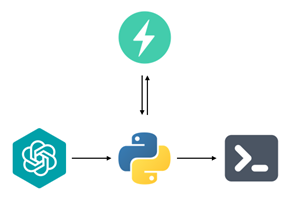

<!-- SOURCE -->
<!-- https://github.com/princeton-nlp/SWE-agent/blob/main/README.md -->

<p align="center">
  <a href="https://www.google.com/">
    
  </a>
</p>

<!-- <p align="center">
  <a href="https://swe-agent.com"><strong>Website & Demo</strong></a>&nbsp; | &nbsp;
  <a href="https://discord.gg/AVEFbBn2rH"><strong>Discord</strong></a>&nbsp; | &nbsp;
  <strong>Paper [coming April 10th]</strong>
</p> -->

## 👋 Overview <a name="overview"></a>
Proof-of-concept for a self-organizing multi-agent system that leverages transformer-based LLMs to autonomously script functional programs for the Ethereum Virtual Machine (EVM), designed within specified operational constraints and aiming to achieve targeted performance metrics and security standards.

<p align="center">
  
</p>


## 🔧 Prerequisites

### Python, Chocolatey, and Poetry

Before you begin, ensure you have the following installed on your system:

- Python 3.8 or above
- [Poetry](https://python-poetry.org/), the dependency manager for Python

To install [Poetry](https://python-poetry.org/) using [Chocolatey](https://chocolatey.org/), follow these steps:

1. Open a command prompt with administrator privileges.
2. Run the following command to install [Chocolatey](https://chocolatey.org/) (if you haven't already):

   ```shell
   Set-ExecutionPolicy Bypass -Scope Process -Force; iex ((New-Object System.Net.WebClient).DownloadString('https://chocolatey.org/install.ps1'))
   ```

3. Once [Chocolatey](https://chocolatey.org/) is installed, run the following command to install [Poetry](https://python-poetry.org/):

    ```shell
    choco install poetry
    ```

This will install [Poetry](https://python-poetry.org/) and its dependencies.

4. Verify the installation by running:

    ```shell
    poetry --version
    ```

## 🚀 Starting
### Setup
To set up your local development environment, follow these steps:

1. Clone the Repository

    First, clone the repository to your local machine:

    ```shell
    git clone https://github.com/yago-mendoza/MaLB-SC-generation-module.git
    cd MaLB-SC-generation-moduleç
    ```

2. Install Dependencies

    Use [Poetry](https://python-poetry.org/) to install the project's dependencies. [Poetry](https://python-poetry.org/) will automatically create a virtual environment for you:

    ```shell
    poetry install
    ```

3. Activate the Virtual Environment

    Once the dependencies are installed, activate the virtual environment:

    ```powershell
    .\.venv\Scripts\Activate
    ```

    This command activates the virtual environment, setting up your shell to use the project’s local dependencies instead of globally installed packages. Ensure that you're using a command-line interface that supports PowerShell commands if you're on Windows, or adapt the command for Unix-based systems as needed.

4. Begin Development

    You can now start working on the project. Feel free to use your IDE or editor of choice. If you are using [VSCode](https://code.visualstudio.com/), it might automatically detect and suggest switching to the virtual environment.

5. Deactivate the Virtual Environment

    When you're done working, you can deactivate the virtual environment to return to your global Python environment:

    ```powershell
    deactivate
    ```
    
    This command will revert your shell settings to the default system configuration, disassociating from the project's local dependencies.

### Running the Project

To run the project or scripts within the virtual environment, ensure the environment is activated, and use Python as you normally would:

    python <your-script.py>

  By following these steps, you'll ensure that your development environment is consistent with other developers on the project, leveraging Poetry for efficient dependency management and virtual environment isolation.

## 📄 License <a name="license"></a>
MIT. Check `LICENSE`.

